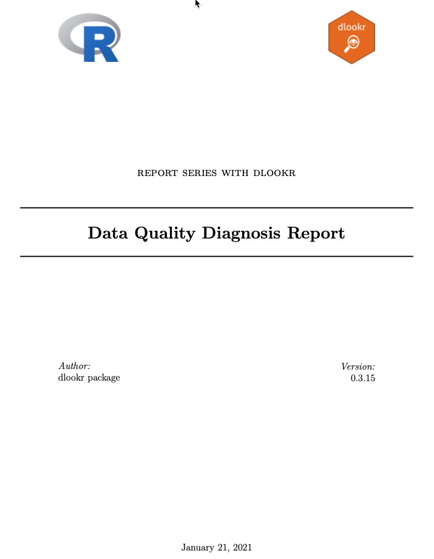
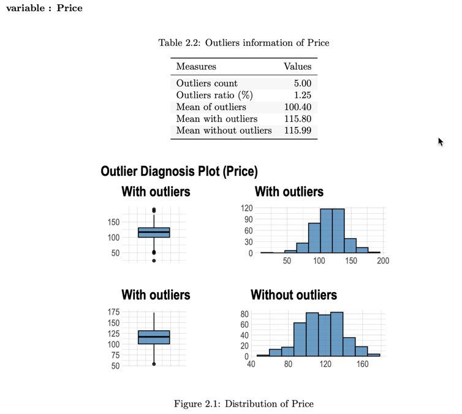
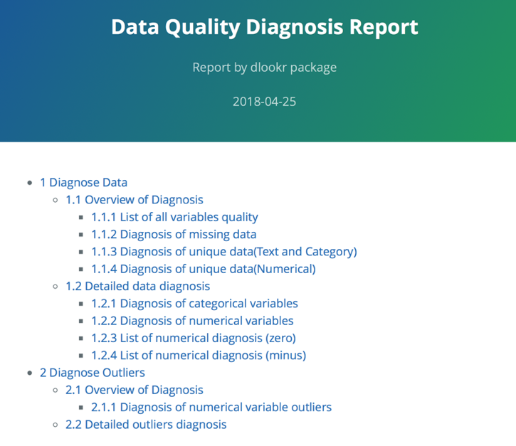
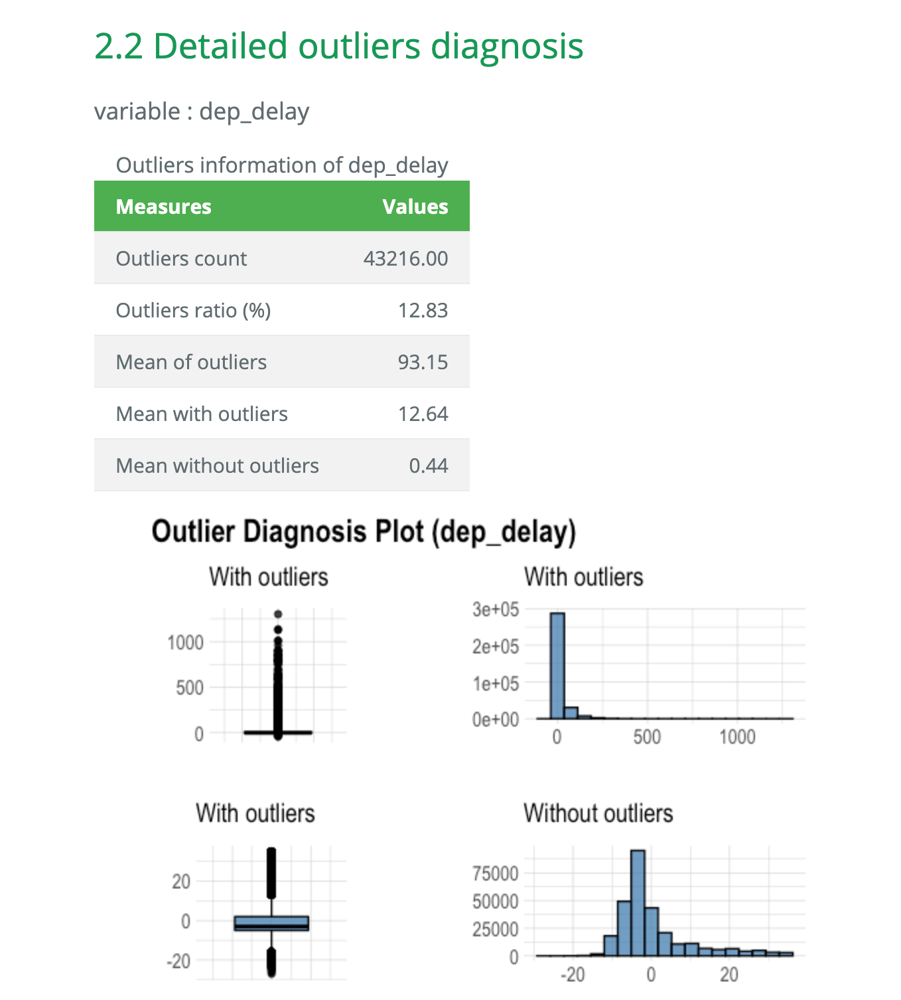

```{r environment, echo=FALSE, message = FALSE}
library(knitr)
knit_hooks$set(htmlcap = function(before, options, envir) {
  if(!before) {
    paste('<p class="caption">',options$htmlcap,"</p>",sep="")
  }
})
```

# Preface
After you have acquired the data, you should do the following:

* **Diagnose data quality.**
    + **If there is a problem with data quality,**
    + **The data must be corrected or re-acquired.**
* Explore data to understand the data and find scenarios for performing the analysis.
* Derive new variables or perform variable transformations.

The dlookr package makes these steps fast and easy:

* **Performs a data diagnosis or automatically generates a data diagnosis report.**
* Discover data in a variety of ways, and automatically generate EDA(exploratory data analysis) report.
* Impute missing values and outliers, resolve skewed data, and binarize continuous variables into categorical variables. And generates an automated report to support it.

This document introduces **Data Quality Diagnosis** methods provided by the dlookr package. You will learn how to diagnose the quality of `tbl_df` data that inherits from data.frame and `data.frame` with functions provided by `dlookr`.

`dlookr` increases synergy when used with the `dplyr` package. Particularly in data exploration and data wrangle, it increases the efficiency of the `tidyverse` package group.

# Overview
## Overall Diagnose Data
Tasks | Descriptions | Functions | Support DBI
:-----|:--------|:---|:---:
describe overview of data | Inquire basic information to understand the data in general | `overview()` | 
summary overview object  | summary described overview of data  | `summary.overview()` | 
plot overview object | plot described overview of data | `plot.overview()` | 
diagnose data quality of variables | The scope of data quality diagnosis is information on missing values and unique value information | `diagnose()` | x
diagnose data quality of categorical variables | frequency, ratio, rank by levels of each variables | `diagnose_category()` | x
diagnose data quality of numerical variables | descriptive statistics, number of zero, minus, outliers | `diagnose_numeric()` | x
diagnose data quality for outlier  | number of outliers, ratio, mean of outliers, mean with outliers, mean without outliers | `diagnose_outlier()` | x
plot outliers information of numerical data  | box plot and histogram whith outliers, without outliers | `plot_outlier.data.frame()` | x
plot outliers information of numerical data by target variable  | box plot and density plot whith outliers, without outliers | `plot_outlier.target_df()` | x
diagnose combination of categorical variables | Check for sparse cases of level combinations of categorical variables | `diagnose_sparese()` | 

## Visualize Missing Values
Tasks | Descriptions | Functions | Support DBI
:-----|:--------|:---|:---:
pareto chart for missing value | visualize pareto chart for variables with missing value. | `plot_na_pareto()` | 
combination chart for missing value | visualize distribution of missing value by combination of variables. | `plot_na_hclust()` | 
plot the combination variables that is include missing value | visualize the combinations of missing value across cases.. | `plot_na_intersect()` | 


## Reporting
Types | Descriptions | Functions | Support DBI
:-----|:-------|:---|:---:
reporting the information of data diagnosis into pdf file | report the information for diagnosing the quality of the data. | `diagnose_report()` | x
reporting the information of data diagnosis into html file | report the information for diagnosing the quality of the data. | `diagnose_report()` | x

## Exercise data: nycflights13::flights

To illustrate basic use of the dlookr package, use the `flights` from the `nycflights13` package. The `flights` data frame is data about departure and arrival on all flights departing from NYC in 2013.

```{r import-data, message = FALSE}
library(dlookr)
library(dplyr)
library(ggplot2)
library(flextable)
library(nycflights13)

glimpse(flights)
```

# Overall Diagnose Data
## Overview data
`overview()` inquire basic information to understand the data in general.

```{r overview}
ov <- overview(flights)
ov %>% 
  flextable()
```

`summary.overview()` tries to be smart about formatting 14 information of overview.

```{r summary-overview}
summary(ov)
```

`plot.overview()` plot the data type, number of observations, and number of missing values for each variable.

```{r plot-overview}
plot(ov)

# sort by name of variables
plot(ov, order_type = "name")

# sort by data type of variables
plot(ov, order_type = "type")
```

## General diagnosis
`diagnose()` allows you to diagnosis a variables in a data frame. Like function of dplyr, the first argument is the tibble (or data frame). The second and subsequent arguments refer to variables within that data frame.

The variables of the `tbl_df` object returned by `diagnose()` are as follows.

* `variables` : variable name
* `types` : the data type of the variable
* `missing_count` : number of missing values
* `missing_percent` : percentage of missing values
* `unique_count` : number of unique values
* `unique_rate` : rate of unique value. unique_count / number of observation

For example, we can diagnose all variables in `flights`:

```{r diagnose, layout="l-body-outset"}
diagnose(flights) %>% 
  flextable()
```

* `Missing Value(NA)` : Variables with very large missing values, ie those with a `missing_percent` close to 100, should be excluded from the analysis.
* `Unique value` : Variables with a unique value (`unique_count` = 1) are considered to be excluded from data analysis. And if the data type is not numeric (integer, numeric) and the number of unique values is equal to the number of observations (`unique_rate` = 1), then the variable is likely to be an identifier. Therefore, this variable is also not suitable for the analysis model.

`year` can be considered not to be used in the analysis model since `unique_count` is 1. However, you do not have to remove it if you configure `date` as a combination of `year`, `month`, and `day`.

For example, we can diagnose only a few selected variables:

```{r diagnoses}
# Select columns by name
diagnose(flights, year, month, day) %>% 
  flextable()

# Select all columns between year and day (inclusive)
diagnose(flights, year:day) %>% 
  flextable()

# Select all columns except those from year to day (inclusive)
diagnose(flights, -(year:day)) %>% 
  flextable()
```

By using dplyr, variables including missing values can be sorted by the weight of missing values.:

```{r diagnose_pipe}
flights %>%
  diagnose() %>%
  select(-unique_count, -unique_rate) %>% 
  filter(missing_count > 0) %>% 
  arrange(desc(missing_count)) %>% 
  flextable()
```

## Diagnosis of numeric variables

`diagnose_numeric()` diagnoses numeric(continuous and discrete) variables in a data frame. Usage is the same as `diagnose()` but returns more diagnostic information. However, if you specify a non-numeric variable in the second and subsequent argument list, the variable is automatically ignored.

The variables of the `tbl_df` object returned by `diagnose_numeric()` are as follows.

* `min` : minimum value
* `Q1` : 1st quartile, 25th percentile
* `mean` : arithmetic mean
* `median` : median, 50th percentile
* `Q3` : 3rd quartile, 75th percentile
* `max` : maximum value
* `zero` : number of observations with a value of 0
* `minus` : number of observations with negative numbers
* `outlier` : number of outliers

Applying the `summary()` function to a data frame can help you figure out the distribution of data by printing `min`, `Q1`, `mean`, `median`, `Q3`, and `max` give. However, the result is that analysts can only look at it with eyes. However, returning such information as a data frame structure like `tbl_df` widens the scope of utilization.

`zero`, `minus`, and `outlier` are useful for diagnosing the integrity of data. For example, numerical data in some cases may not have 0 or a negative number.
Since the hypothetical numeric variable 'employee salary' can not have a negative or zero value, you should check for zero or negative numbers in the data diagnosis process.

`diagnose_numeric()` can diagnose all numeric variables of `flights` as follows.:

```{r diagnose_pipe_numeric}
diagnose_numeric(flights) %>% 
  flextable()
```

If a numeric variable can not logically have a negative or zero value, it can be used with `filter()` to easily find a variable that does not logically match:

```{r diagnose_pipe_numeric_pipe}
diagnose_numeric(flights) %>% 
  filter(minus > 0 | zero > 0) %>% 
  flextable()
```

## Diagnosis of categorical variables

`diagnose_category()` diagnoses the categorical(factor, ordered, character) variables of a data frame. The usage is similar to `diagnose ()` but returns more diagnostic information. If you specify a non-categorical variable in the second and subsequent argument list, the variable is automatically ignored.
The top argument specifies the number of levels to return per variable. The default value is 10, which returns the top 10 level. Of course, if the number of levels is less than 10, all levels are returned.

The variables of the `tbl_df` object returned by `diagnose_category()` are as follows.

* `variables` : variable names
* `levels`: level names
* `N` : Number of observation
* `freq` : Number of observation at the levels
* `ratio` : Percentage of observation at the levels
* `rank` : Rank of occupancy ratio of levels

``diagnose_category()` can diagnose all categorical variables of `flights` as follows.:

```{r diagnose_category}
diagnose_category(flights) %>% 
  flextable()
```

In collaboration with `filter()` in the `dplyr` package, we can see that the `tailnum` variable is ranked in top 1 with 2,512 missing values in the case where the missing value is included in the top 10:

```{r diagnose_category_pipe}
diagnose_category(flights) %>% 
  filter(is.na(levels)) %>% 
  flextable()
```

The following returns a list of levels less than or equal to 0.01%. It should be noted that the top argument has a generous specification of 500. If you use the default value of 10, values below 0.01% would not be included in the list:

```{r diagnose_category_pipe2}
flights %>%
  diagnose_category(top = 500)  %>%
  filter(ratio <= 0.01) %>% 
  flextable()
```

In the analytic model, it is also possible to consider removing the small percentage of observations in the observations or joining them together.


## Diagnosing outliers 
`diagnose_outlier()` diagnoses the outliers of the numeric (continuous and discrete) variables of the data frame. The usage is the same as `diagnose()`.

The variables of the `tbl_df` object returned by `diagnose_outlier()` are as follows.

* `outliers_cnt` : Count of outliers
* `outliers_ratio` : Percent of outliers
* `outliers_mean` : Arithmetic Average of outliers
* `with_mean` : Arithmetic Average of with outliers
* `without_mean` : Arithmetic Average of without outliers

`diagnose_outlier()` can diagnose anomalies of all numeric variables of `flights` as follows:

```{r diagnose_outlier}
diagnose_outlier(flights) %>% 
  flextable()
```

Numeric variables that contain anomalies are easily found with `filter()`.:

```{r diagnose_outlier_pipe}
diagnose_outlier(flights) %>% 
  filter(outliers_cnt > 0) %>% 
  flextable()
```

The following is a list of numeric variables with anomalies greater than 5%.:

```{r diagnose_outlier_pipe2}
diagnose_outlier(flights) %>% 
  filter(outliers_ratio > 5) %>% 
  mutate(rate = outliers_mean / with_mean) %>% 
  arrange(desc(rate)) %>% 
  select(-outliers_cnt) %>% 
  flextable()
```

If the outlier is larger than the average of all observations, it may be desirable to replace or remove the outlier in the data analysis process.

## Visualization of outliers
`plot_outlier()` visualizes outliers of numerical variables(continuous and discrete) of data.frame. Usage is the same `diagnose()`.

The plot derived from the numerical data diagnosis is as follows.

* With outliers box plot
* Without outliers box plot
* With outliers histogram
* Without outliers histogram

`plot_outlier()` can visualize an anomaly in the `arr_delay` variable of `flights` as follows:

```{r plot_outlier, fig.width = 7, fig.height = 4}
flights %>%
  plot_outlier(arr_delay) 
```

Use the function of the dplyr package and `plot_outlier()` and `diagnose_outlier()` to visualize anomaly values of all numeric variables with an outlier ratio of 0.5% or more.:

```{r plot_outlier_pipe, fig.width = 7, fig.height = 4}
flights %>%
  plot_outlier(diagnose_outlier(flights) %>% 
                 filter(outliers_ratio >= 0.5) %>% 
                 select(variables) %>% 
                 unlist())
```

You should look at the visualization results and decide whether to remove or replace the outliers. In some cases, it is important to consider removing the variables that contain anomalies from the data analysis model.

In the visualization results, `arr_delay` has similar distributions to the normal distribution of the observed values. In the case of linear models, we can also consider removing or replacing anomalies. And `air_time` shows a roughly similar distribution before and after removing anomalies.

## Check sparse cases
`diagnose_sparese()` checks for combinations of levels that do not appear as data among all combinations of levels of categorical variables.

```{r diagnose_sparese, fig.width = 7, fig.height = 4}
glimpse(heartfailure)

diagnose_sparese(heartfailure) %>% 
  flextable()

# Adjust the threshold of limt to calculate
diagnose_sparese(heartfailure, limit = 50)

# List all combinations, including sparse cases
diagnose_sparese(heartfailure, type = "all") %>% 
  flextable()  

# collaboration with dplyr
heartfailure %>% 
  diagnose_sparese(type = "all") %>% 
  arrange(desc(n_case)) %>% 
  mutate(percent = round(n_case / sum(n_case) * 100, 1)) %>% 
  filter(percent > 3) %>% 
  flextable()
```


# Visualize missing values
## Pareto chart 
`plot_na_pareto()` visualize pareto chart for variables with missing value.

```{r plot_na_pareto, fig.width = 7, fig.height = 4}
plot_na_pareto(flights)

# Visualize only variables containing missing values
plot_na_pareto(flights, only_na = TRUE)

# Change the grade
plot_na_pareto(flights, grade = list(High = 0.1, Middle = 0.6, Low = 1))

# Return the aggregate information about missing values.
plot_na_pareto(flights, only_na = TRUE, plot = FALSE)
```

## Combination chart using hclust
`plot_na_hclust()` visualize distribution of missing value by combination of variables using `hclust()`.

```{r plot_na_hclust, fig.width = 7, fig.height = 4}
# Generate data for the example
set.seed(123L)
flights2 <- flights[sample(nrow(flights), size = 1000), ]

# Visualize hcluster chart for variables with missing value.
plot_na_hclust(flights2)
```

## Combination chart
`plot_na_intersect()` visualize the combinations of missing value across cases.

```{r plot_na_intersect, fig.width = 7, fig.height = 4}
# Visualize the combination variables that is include missing value.
plot_na_intersect(flights2)

# Visualize variables containing missing values and complete case
plot_na_intersect(flights2, only_na = FALSE)

# Using n_vars argument
plot_na_intersect(flights2, n_vars = 5) 

# Using n_intersects argument
plot_na_intersect(flights2, only_na = FALSE, n_intersacts = 3)
```

# Create a diagnostic report
`diagnose_report()` performs data diagnosis of all variables of object inherited from data.frame(`tbl_df`, `tbl`, etc) or data.frame.

`diagnose_report() writes the report in two formats:

* Latex based pdf file
* html file

The contents of the report are as follows.:

* Diagnose Data
    + Overview of Diagnosis
        + List of all variables quality
        + Diagnosing Missing Data
        + Diagnosis of unique data(Text and Category)
        + Diagnosis of unique data(Numerical)
    + Detailed data diagnosis
        + Diagnosis of categorical variables
        + Diagnosis of numerical variables
        + List of numerical diagnosis (zero)
        + List of numerical diagnosis (minus)
* Diagnose Outliers
    + Overview of Diagnosis
        + Diagnosis of numerical variable outliers
        + Detailed outliers diagnosis

The following creates a quality diagnostic report for flights, a `tbl_df` class object. The file format is pdf and file name is `DataDiagnosis_Report.pdf`.

```{r diagnose_report, eval=FALSE}
flights %>%
  diagnose_report()
```


The following script creates an html report named `DataDiagnosis_Report.html`.

```{r, eval=FALSE}
flights %>%
  diagnose_report(output_format = "html")
```

The following generates an HTML report named `Diagn.html`.

```{r, eval=FALSE}
flights %>%
  diagnose_report(output_format = "html", output_file = "Diagn.html")
```

The `Data Diagnostic Report` is an automated report intended to aid in the data diagnosis process. It judged whether the data is supplemented or reacquired by referring to the report results.

## Contents of pdf file

* The cover of the report is shown in the following figure.:

```{r diag_title_pdf, echo=FALSE, out.width='80%'}

```

* The contents of the report are shown in the following figure.:

```{r diag_agenda_pdf, echo=FALSE, out.width='80%'}
knitr::include_graphics('img/diagn_agenda_pdf.png')
```

* Most information is represented in the report as a table. An example of a table is shown in the following figure.:

```{r diag_intro_pdf, echo=FALSE, out.width='80%'}
knitr::include_graphics('img/diag_intro_pdf.png')
```

* In the data diagnosis report, the outlier diagnostic contents include visualization results. The result is shown in the following figure.:

```{r diag_outlier_pdf, echo=FALSE, out.width='80%'}

```

## Contents of html file
* The title and contents of the report are shown in the following figure.:

```{r diag_egenda_html, echo=FALSE, out.width='80%'}

```

* Most of the information is represented in tables in reports. An example of a table in an html file is shown in the following figure.

```{r diag_table_html, echo=FALSE, out.width='80%'}
knitr::include_graphics('img/diag_table_html.png')
```

* In the data diagnosis report, the outlier diagnostic contents include visualization results. The result of the html file is shown in the following figure.

```{r diag_outlier_html, echo=FALSE, out.width='80%'}

```
