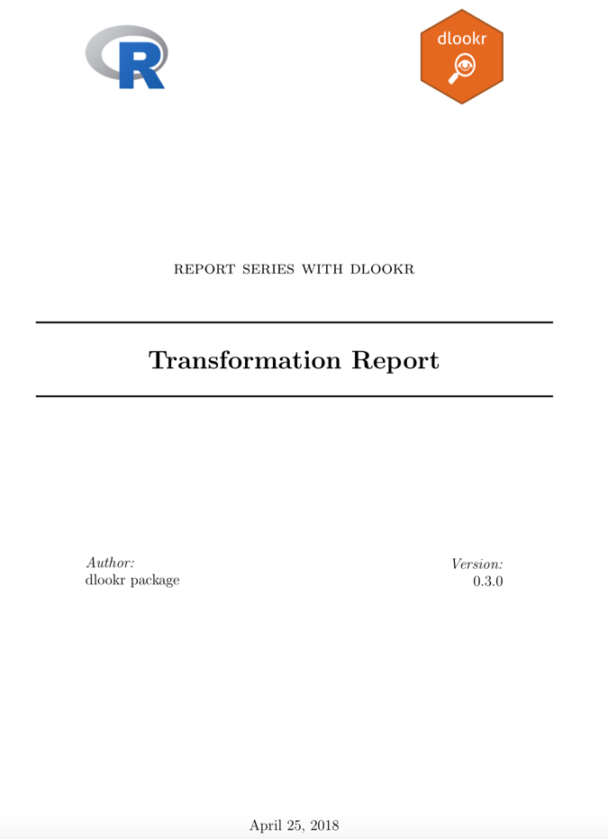
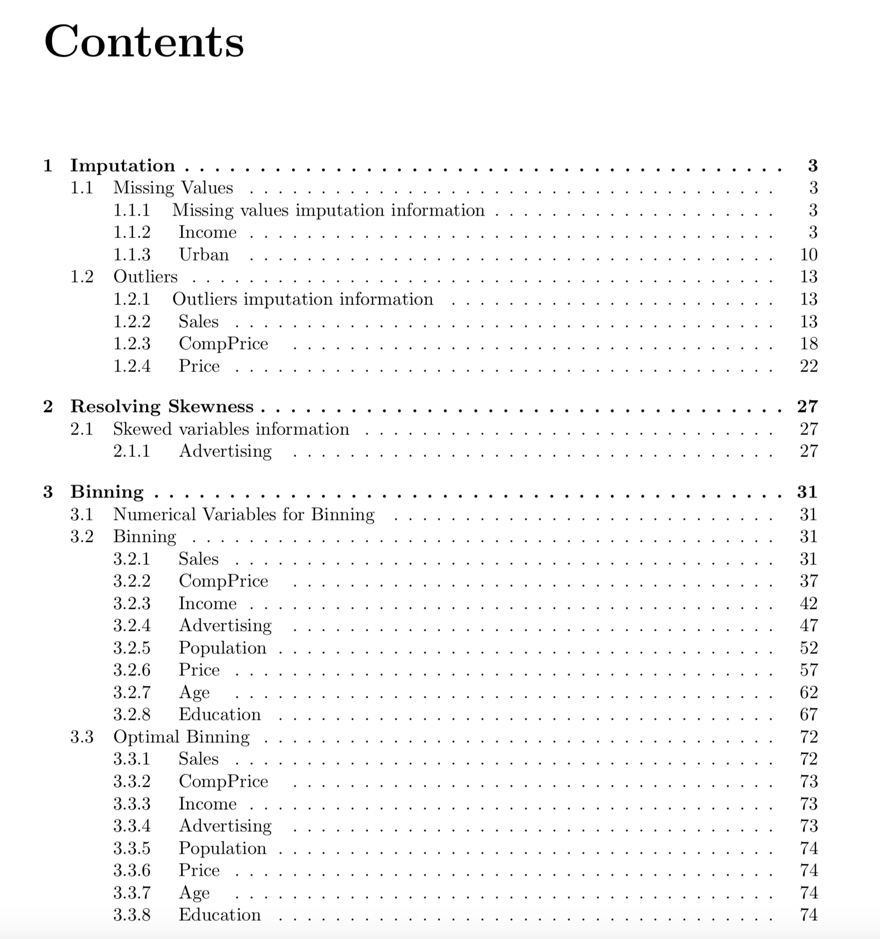
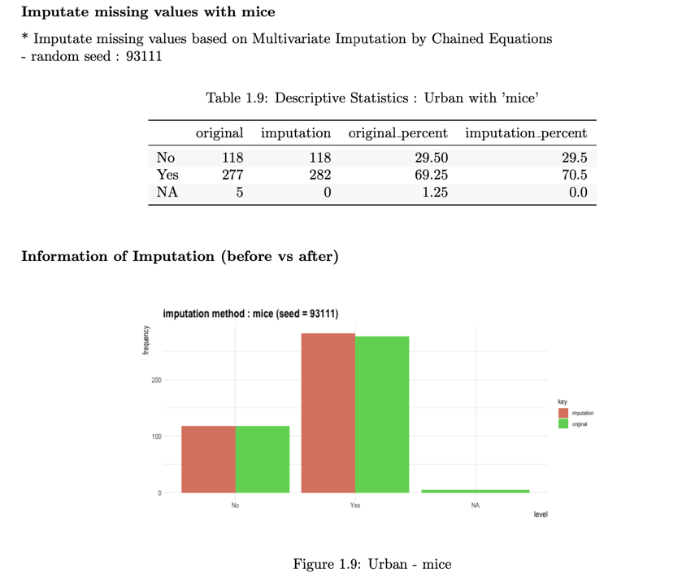

```{r environment, echo=FALSE, message = FALSE}
library(knitr)
knit_hooks$set(htmlcap = function(before, options, envir) {
  if(!before) {
    paste('<p class="caption">',options$htmlcap,"</p>",sep="")
  }
})
```

# Preface
After you have acquired the data, you should do the following:

* Diagnose data quality.
    + If there is a problem with data quality,
    + The data must be corrected or re-acquired.
* Explore data to understand the data and find scenarios for performing the analysis.
* **Derive new variables or perform variable transformations.**

The dlookr package makes these steps fast and easy:

* Performs a data diagnosis or automatically generates a data diagnosis report.
* Discover data in a variety of ways, and automatically generate EDA(exploratory data analysis) report.
* **Impute missing values and outliers, resolve skewed data, and binaries continuous variables into categorical variables. And generates an automated report to support it.**

This document introduces **data transformation** methods provided by the dlookr package. You will learn how to transform of `tbl_df` data that inherits from data.frame and `data.frame` with functions provided by dlookr.

`dlookr` increases synergy when used with the `dplyr` package. Particularly in data exploration and data wrangle, it increases the efficiency of the `tidyverse` package group.

# Overview
## Find Variables
Types | Descriptions | Functions | Support DBI
:---|:-------|:---|:---:
missing values  | find the variable that contains the missing value in the object that inherits the data.frame | `find_na()` | 
outliers | find the numerical variable that contains outliers in the object that inherits the data.frame | `find_outliers()` | 
skewed variable | find the numerical variable that skewed variable that inherits the data.frame | `find_skewness()` | 

## Imputation
Types | Descriptions | Functions | Support DBI
:---|:-------|:---|:---:
missing values  | missing values are imputed with some representative values and statistical methods. | `imputate_na()` | 
outliers | outliers are imputed with some representative values and statistical methods. | `imputate_outlier()` | 
summaries | calculate descriptive statistics of the original and imputed values. | `summary.imputation()` | 
visualize | the imputation of a numerical variable is a density plot, and the imputation of a categorical variable is a bar plot. | `plot.imputation()` | 

## Binning
Types | Descriptions | Functions | Support DBI
:---|:-------|:---|:---:
binning | converts a numeric variable to a categorization variable | `binning()` | 
summaries | calculate frequency and relative frequency for each levels(bins) | `summary.bins()` | 
visualize | visualize two plots on a single screen. The plot at the top is a histogram representing the frequency of the level. The plot at the bottom is a bar chart representing the frequency of the level. | `plot.bins()` | 
optimal binning | categorizes a numeric characteristic into bins for ulterior usage in scoring modeling | `binning_by()` | 
summaries | summary metrics to evaluate the performance of binomial classification model | `summary.optimal_bins()` | 
visualize | generates plots for understand distribution, bad rate, and weight of evidence after running binning_by() | `plot.optimal_bins()` | 
evaluate | calculates metrics to evaluate the performance of binned variable for binomial classification model | `performance_bin()` | 
summaries | summary metrics to evaluate the performance of binomial classification model after performance_bin() | `summary.performance_bin()` | 
visualize | It generates plots for understand frequency, WoE by bins using performance_bin after running binning_by() | `plot.performance_bin()` | 
visualize | extract bins from "bins" and "optimal_bins" objects | `extract.bins()` | 

## Diagnose Binned Variable
Types | Descriptions | Functions | Support DBI
:---|:-------|:---|:---:
diagnosis | performs diagnose performance that calculates metrics to evaluate the performance of binned variable for binomial classification model. | `performance_bin()` | 
summaries | summary method for "performance_bin". summary metrics to evaluate the performance of binomial classification model. | `
summary.performance_bin()` | 
visualize | visualize for understand frequency, WoE by bins using performance_bin and something else. | `plot.performance_bin()` | 

## Transformation
Types | Descriptions | Functions | Support DBI
:---|:-------|:---|:---:
transformation | performs variable transformation for standardization and resolving skewness of numerical variables. | `transform()` | 
summaries | compares the distribution of data before and after data transformation | `summary.transform()` | 
visualize | visualize two kinds of plot by attribute of 'transform' class. The transformation of a numerical variable is a density plot. | `plot.transform()` | 

## Reporting
Types | Descriptions | Functions | Support DBI
:-----|:--------|:---|:---:
reporting the information of transformation into pdf | reporting the information of transformation. | `transformation_report()` | 
reporting the information of transformation into html | reporting the information of transformation. | `transformation_report()` | 


## Exercise data: ISLR::Carseats

To illustrate the basic use of EDA in the dlookr package, I use a `Carseats` datasets.
`Carseats` in the `ISLR` package is simulation dataset that sells children's car seats at 400 stores. This data is a data.frame created for the purpose of predicting sales volume.

```{r import-data, message = FALSE}
library(dlookr)
library(dplyr)
library(flextable)
library(rmarkdown)

glimpse(ISLR::Carseats)
```

The contents of individual variables are as follows. (Refer to ISLR::Carseats Man page)

* Sales
    + Unit sales (in thousands) at each location
* CompPrice
    + Price charged by competitor at each location
* Income
    + Community income level (in thousands of dollars)
* Advertising
    + Local advertising budget for company at each location (in thousands of dollars)
* Population
    + Population size in region (in thousands)
* Price
    + Price company charges for car seats at each site
* ShelveLoc
    + A factor with levels Bad, Good and Medium indicating the quality of the shelving location for the car seats at each site
* Age
    + Average age of the local population
* Education
    + Education level at each location
* Urban
    + A factor with levels No and Yes to indicate whether the store is in an urban or rural location
* US
    + A factor with levels No and Yes to indicate whether the store is in the US or not

When data analysis is performed, data containing missing values is often encountered. However, Carseats is complete data without missing. Therefore, the missing values are generated as follows. And I created a data.frame object named carseats.

```{r missing}
carseats <- ISLR::Carseats

set.seed(123)
carseats[sample(seq(NROW(carseats)), 20), "Income"] <- NA

set.seed(456)
carseats[sample(seq(NROW(carseats)), 10), "Urban"] <- NA
```

# Find issue variables
## Find missing value

`find_na()` find the variable that contains the missing value in the object that inherits the data.frame or data.frame.

```{r find_na}
find_na(carseats)

find_na(carseats, index = FALSE)

find_na(carseats, rate = TRUE)

## using dplyr -------------------------------------
# Perform simple data quality diagnosis of variables with missing values.
carseats %>%
  select(find_na(.)) %>%
  diagnose() %>% 
  flextable()
```

## Find outliers

`find_outliers()` find the numerical variable that contains outliers in the object that inherits the data.frame or data.frame.

```{r find_outliers}
find_outliers(carseats)

find_outliers(carseats, index = FALSE)

find_outliers(carseats, rate = TRUE)

## using dplyr -------------------------------------
# Perform simple data quality diagnosis of variables with outliers.
carseats %>%
  select(find_outliers(.)) %>%
  diagnose() %>% 
  flextable()
```

## Find skewed variables

`find_skewness()` find the numerical variable that skewed variable that inherits the data.frame or data.frame.

```{r find_skewness}
find_skewness(carseats)

find_skewness(carseats, index = FALSE)

find_skewness(carseats, thres = 0.1)

find_skewness(carseats, value = TRUE)

find_skewness(carseats, value = TRUE, thres = 0.1)

## using dplyr -------------------------------------
# Perform simple data quality diagnosis of skewed variables
carseats %>%
  select(find_skewness(.)) %>%
  diagnose() %>% 
  flextable()
```


# Imputation of missing values
## imputes the missing value

`imputate_na()` imputes the missing value contained in the variable. The predictor with missing values support both numeric and categorical variables, and supports the following `method`.

* predictor is numerical variable
    + "mean" : arithmetic mean
    + "median" : median
    + "mode" : mode
    + "knn" : K-nearest neighbors
        + target variable must be specified
    + "rpart" : Recursive Partitioning and Regression Trees
        + target variable must be specified    
    + "mice" : Multivariate Imputation by Chained Equations
        + target variable must be specified  
        + random seed must be set
* predictor is categorical variable
    + "mode" : mode
    + "rpart" : Recursive Partitioning and Regression Trees
        + target variable must be specified    
    + "mice" : Multivariate Imputation by Chained Equations
        + target variable must be specified  
        + random seed must be set
    
In the following example, `imputate_na()` imputes the missing value of `Income`, a numeric variable of carseats, using the "rpart" method. `summary()` summarizes missing value imputation information, and `plot()` visualizes missing information.

```{r imputate_na, fig.align='center', fig.width = 7, fig.height = 5}
if (requireNamespace("rpart", quietly = TRUE)) {
  income <- imputate_na(carseats, Income, US, method = "rpart")

  # result of imputation
  income

  # summary of imputation
  summary(income)

  # viz of imputation
  plot(income)
} else {
  cat("If you want to use this feature, you need to install the rpart package.\n")
}
```

The following imputes the categorical variable `urban` by the "mice" method.

```{r imputate_na2, fig.align='center', fig.width = 7, fig.height = 5}
library(mice)

urban <- imputate_na(carseats, Urban, US, method = "mice")

# result of imputation
urban

# summary of imputation
summary(urban)

# viz of imputation
plot(urban)
```
    
## Collaboration with dplyr
The following example imputes the missing value of the `Income` variable, and then calculates the arithmetic mean for each level of `US`. In this case, `dplyr` is used, and it is easily interpreted logically using pipes.

```{r imputate_na3}
# The mean before and after the imputation of the Income variable
carseats %>%
  mutate(Income_imp = imputate_na(carseats, Income, US, method = "knn")) %>%
  group_by(US) %>%
  summarise(orig = mean(Income, na.rm = TRUE),
            imputation = mean(Income_imp))
```


# Imputation of outliers
## imputes the outliers

`imputate_outlier()` imputes the outliers value. The predictor with outliers supports only numeric variables and supports the following methods.

* predictor is numerical variable
    + "mean" : arithmetic mean
    + "median" : median
    + "mode" : mode
    + "capping" : Impute the upper outliers with 95 percentile, and Impute the bottom outliers with 5 percentile.

`imputate_outlier()` imputes the outliers with the numeric variable `Price` as the "capping" method, as follows. `summary()` summarizes outliers imputation information, and `plot()` visualizes imputation information.

```{r imputate_outlier, fig.align='center', fig.width = 7, fig.height = 5}
price <- imputate_outlier(carseats, Price, method = "capping")

# result of imputation
price

# summary of imputation
summary(price)

# viz of imputation
plot(price)
```

## Collaboration with dplyr
The following example imputes the outliers of the `Price` variable, and then calculates the arithmetic mean for each level of `US`. In this case, `dplyr` is used, and it is easily interpreted logically using pipes.

```{r imputate_outlier2}
# The mean before and after the imputation of the Price variable
carseats %>%
  mutate(Price_imp = imputate_outlier(carseats, Price, method = "capping")) %>%
  group_by(US) %>%
  summarise(orig = mean(Price, na.rm = TRUE),
    imputation = mean(Price_imp, na.rm = TRUE))
```
    
# Binning
## Binning of individual variables

`binning()` transforms a numeric variable into a categorical variable by binning it. The following types of binning are supported.

* "quantile" : categorize using quantile to include the same frequencies
* "equal" : categorize to have equal length segments
* "pretty" : categorized into moderately good segments
* "kmeans" : categorization using K-means clustering
* "bclust" : categorization using bagged clustering technique

Here are some examples of how to bin `Income` using `binning()`.:

```{r binning, fig.width = 7, fig.height = 5}
# Binning the carat variable. default type argument is "quantile"
bin <- binning(carseats$Income)
# Print bins class object
bin
# Summarize bins class object
summary(bin)
# Plot bins class object
plot(bin)
# Using labels argument
bin <- binning(carseats$Income, nbins = 4,
              labels = c("LQ1", "UQ1", "LQ3", "UQ3"))
bin
# Using another type argument
binning(carseats$Income, nbins = 5, type = "equal")
binning(carseats$Income, nbins = 5, type = "pretty")

if (requireNamespace("classInt", quietly = TRUE)) {
  binning(carseats$Income, nbins = 5, type = "kmeans")
  binning(carseats$Income, nbins = 5, type = "bclust")
} else {
  cat("If you want to use this feature, you need to install the classInt package.\n")
}

# Extract the binned results
extract(bin)

# -------------------------
# Using pipes & dplyr
# -------------------------
library(dplyr)

carseats %>%
 mutate(Income_bin = binning(carseats$Income) %>% 
                     extract()) %>%
 group_by(ShelveLoc, Income_bin) %>%
 summarise(freq = n()) %>%
 arrange(desc(freq)) %>%
 head(10)
```
    
## Optimal Binning

`binning_by()` transforms a numeric variable into a categorical variable by optimal binning. This method is often used when developing a `scorecard model`.

The following `binning_by()` example optimally binning `Advertising` considering the target variable `US` with a binary class.

```{r binning_by, fig.width = 7, fig.height = 5}
library(dplyr)

# optimal binning using character
bin <- binning_by(carseats, "US", "Advertising")

# optimal binning using name
bin <- binning_by(carseats, US, Advertising)
bin

# summary optimal_bins class
summary(bin)

# performance table
attr(bin, "performance")

# visualize optimal_bins class
plot(bin)

# extract binned results
extract(bin) %>% 
  head(20)
```

# Diagnose binned variable
## Performance binned variable
`performance_bin()` calculates metrics to evaluate the performance of binned variable for binomial classification model.

```{r performance_bin, fig.width = 7, fig.height = 5}
# Generate data for the example
heartfailure2 <- heartfailure

set.seed(123)
heartfailure2[sample(seq(NROW(heartfailure2)), 5), "creatinine"] <- NA

# Change the target variable to 0(negative) and 1(positive).
heartfailure2$death_event_2 <- ifelse(heartfailure2$death_event %in% "Yes", 1, 0)

# Binnig from creatinine to platelets_bin.
breaks <- c(0,  1,  2, 10)
heartfailure2$creatinine_bin <- cut(heartfailure2$creatinine, breaks)

# Diagnose performance binned variable
perf <- performance_bin(heartfailure2$death_event_2, heartfailure2$creatinine_bin) 
perf
```

## Summarizing performance
`summary.performance_bin()` summarize metrics to evaluate the performance of binomial classification model.

```{r summary_performance_bin}
summary(perf)
```

## Visualize performance
`plot.performance_bin()` visualize metrics to evaluate the performance of binomial classification model.

```{r plot_performance_bin, fig.width = 7, fig.height = 5}
plot(perf)
```


# Transformation
## Introduction transformation
`transform()` performs data transformation. Only numeric variables are supported, and the following methods are provided.

* Standardization
    + "zscore" : z-score transformation. (x - mu) / sigma
    + "minmax" : minmax transformation. (x - min) / (max - min)
* Resolving Skewness
    + "log" : log transformation. log(x)
    + "log+1" : log transformation. log(x + 1). Used for values that contain 0.
    + "sqrt" : square root transformation.
    + "1/x" : 1 / x transformation
    + "x^2" : x square transformation
    + "x^3" : x^3 square transformation

## Standardization
Use the methods "zscore" and "minmax" to perform standardization.

```{r standardization, fig.align='center', fig.width = 7, fig.height = 5}
carseats %>% 
  mutate(Income_minmax = transform(carseats$Income, method = "minmax"),
    Sales_minmax = transform(carseats$Sales, method = "minmax")) %>% 
  select(Income_minmax, Sales_minmax) %>% 
  boxplot()
```

## Resolving Skewness data
`find_skewness()` searches for variables with skewed data. This function finds data skewed by search conditions and calculates skewness.

```{r resolving1}
# find index of skewed variables
find_skewness(carseats)

# find names of skewed variables
find_skewness(carseats, index = FALSE)

# compute the skewness
find_skewness(carseats, value = TRUE)

# compute the skewness & filtering with threshold
find_skewness(carseats, value = TRUE, thres = 0.1)
```

The skewness of `Advertising` is 0.637. This means that the distribution of data is somewhat inclined to the left. So, for normal distribution, use `transform()` to convert to "log" method as follows.
`summary()` summarizes transformation information, and `plot()` visualizes transformation information.

```{r resolving2, fig.align='center', fig.width = 7, fig.height = 5}
Advertising_log = transform(carseats$Advertising, method = "log")

# result of transformation
head(Advertising_log)
# summary of transformation
summary(Advertising_log)
# viz of transformation
plot(Advertising_log)
```

It seems that the raw data contains 0, as there is a -Inf in the log converted value. So this time, convert it to "log+1".

```{r resolving3, fig.align='center', fig.width = 7, fig.height = 5}
Advertising_log <- transform(carseats$Advertising, method = "log+1")

# result of transformation
head(Advertising_log)
# summary of transformation
summary(Advertising_log)
# viz of transformation
# plot(Advertising_log)
```


# Creating a data transformation report
`transformation_report()` generates a data transformation report for all the variables in the data frame or objects that inherit the data frame (`tbl_df`, `tbl`, etc.).

`transformation_report()` generates a data transformation report in two forms:

* pdf file based on Latex
* html file

The contents of the report are as follows.:

* Imputation
    + Missing Values
        + Missing values imputation information
        + (variable names)
    + Outliers
        + Outliers imputation information
        + (variable names)
* Resolving Skewness
    + Skewed variables information
        + (variable names)
* Binning
    + Numerical Variables for Binning
    + Binning
        + (variable names)
    + Optimal Binning
        + (variable names)

The following generates a data transformation report for `carseats`. The file format is pdf, and the file name is `Transformation_Report.pdf`.

```{r trans_report, eval=FALSE}
carseats %>%
  transformation_report(target = US)
```

The following generates a report in html format called `transformation_carseats.html`.

```{r, eval=FALSE}
carseats %>%
  transformation_report(target = US, output_format = "html", 
    output_file = "transformation_carseats.html")
```

Data transformation reports are automated reports to assist in the data transformation process. Design data conversion scenarios by referring to the report results.

### Data transformation report contents
#### Contents of pdf file
* The cover of the report is shown in the following figure.

```{r trans_title_pdf, echo=FALSE, out.width='75%'}

```

* The report's agenda is shown in the following figure.

```{r trans_agenda_pdf, echo=FALSE, out.width='75%'}

```

* Much of the information is displayed in tables and visualization results in reports. An example is shown in the following figure.

```{r trans_content_pdf, echo=FALSE, out.width='75%'}

```
